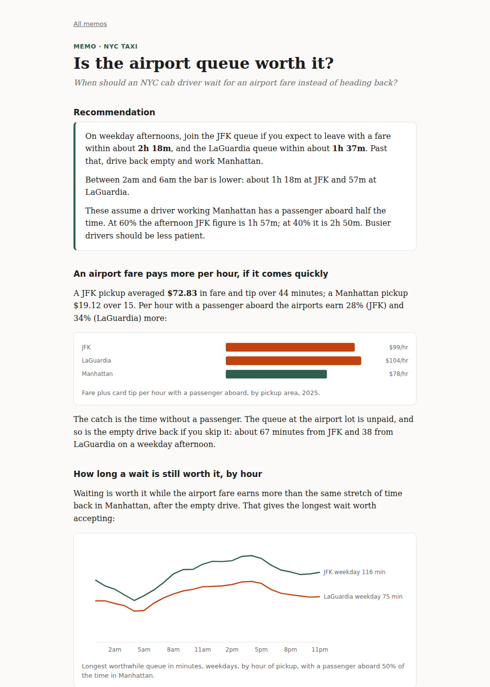

# case-studies

Short analytical memos on public data, each ending in a recommendation someone could act on.
Python, DuckDB, Jinja, inline SVG. Every figure is rebuilt from small committed snapshots.

**Read them: [m4dd0ck.github.io/case-studies](https://m4dd0ck.github.io/case-studies/)**



## The memos

| Memo | Question | Answer (short) | Data |
|---|---|---|---|
| [Is the airport queue worth it?](https://m4dd0ck.github.io/case-studies/airport-queue.html) | When should an NYC cab driver wait for an airport fare instead of heading back? | Weekday afternoons: if the wait is under about 2h 18m at JFK and 1h 37m at LaGuardia. Much less at night. | TLC yellow-cab trips, 2025 (43.8M trips) |
| [Which card complaints to fix first](https://m4dd0ck.github.io/case-studies/card-complaints.html) | Which credit-card complaint issues are growing and costing issuers money? | Disputed statement purchases and fees/interest: 48% of complaints, 74% of those ending in money back. One apparent jump is likely a relabel. | CFPB complaint database, 2024-2026 |

Each memo follows the same shape: recommendation first, then the findings behind it, the
caveats (what the data cannot tell you), next steps, and the method in the footer.

## How the numbers are made

- **Airport queue.** Break-even wait `W = A / r - T + D`: the airport fare `A` over `T` minutes,
  against Manhattan earnings per minute `r` and the empty drive back `D`. Trip records do not
  show time without a passenger, so `r` is shown at 40%, 50% and 60% utilization rather than
  guessed at one value.
- **Card complaints.** Priority = complaints x the share historically closed with money back.
  Issue pairs where one's loss matches most of the other's gain, switching in the same month,
  are flagged as likely relabels and quoted together.

`tests/test_memos.py` pins every figure a memo quotes, so a change to a snapshot or formula
fails the tests before it changes a recommendation.

## Usage

Needs Python 3.12+ and [uv](https://github.com/astral-sh/uv).

```bash
uv sync
uv run memos site             # render site/ from the committed snapshots (no network)
uv run memos extract-taxi     # rebuild data/taxi_hourly_2025.csv from TLC parquet (~700 MB read)
uv run memos extract-cfpb     # rebuild the complaint snapshots from the CFPB API
uv run pytest
```

## Project structure

```
data/                    # committed snapshots the memos are built from
src/case_studies/
├── taxi.py              # TLC extract + break-even wait
├── cfpb.py              # CFPB extract, growth, relief rates, relabel detection
├── charts.py            # inline SVG
├── memos/               # one module per memo: snapshot -> the facts it quotes
├── templates/           # one template per memo
├── site.py              # renders the memos + index
└── cli.py               # memos site | extract-taxi | extract-cfpb
```

## Data sources

- NYC Taxi & Limousine Commission, [TLC Trip Record Data](https://www.nyc.gov/site/tlc/about/tlc-trip-record-data.page)
- Consumer Financial Protection Bureau, [Consumer Complaint Database](https://www.consumerfinance.gov/data-research/consumer-complaints/)

## License

MIT
